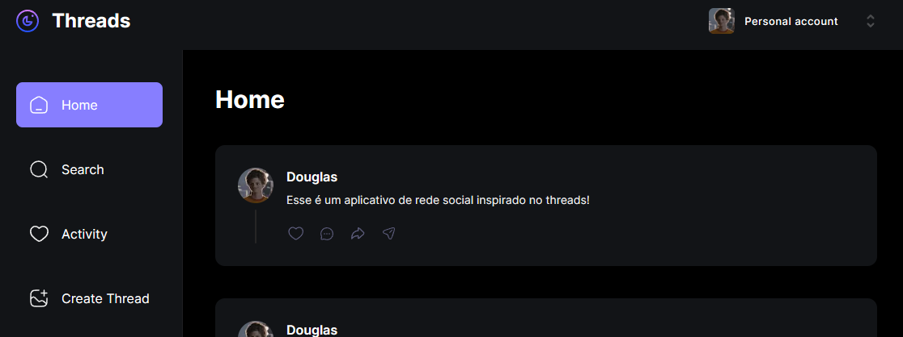

<h2 align="center">
  
</h2>

## Sobre o Projeto

### [VISUALIZAR O PROJETO](https://threads-app-orpin-beta.vercel.app/)

Threads é um aplicativo de rede social inspirado no Threads, que utiliza NextJs como backend.

## Tecnologias

Lista de tecnologias utilizadas no projeto:

- Nextjs 13
- React
- TypeScript
- Tailwindcss
- Mongoose

## TO DO

[X] Like
[ ] Editar perfil
[ ] Excluir uma thread
[ ] Comunidades
[ ] Internationalization

## Executando o projeto

1. Clone o repositório e instale as dedependências:

```bash
$ git clone https://github.com/douglasrochak/threads-app.git
$ cd threads-app
$ bun install
```

2. Execute o projeto:

```bash
bun dev
```
